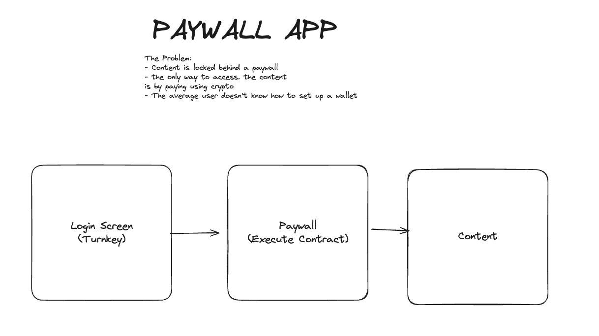
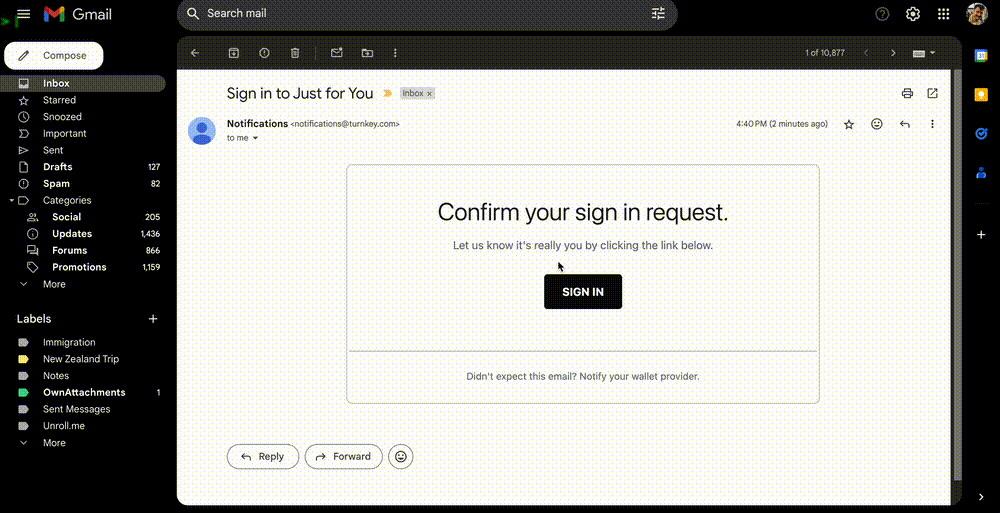

## Paywall App

This demo shows a simple flow where a piece of content is paywalled behind an ethereum transaction.
The main idea behind this is for users to not have wallets before interacting with the application, therefore the application uses turnkey to provision a wallet & authorize the user.

## Basic design

## Demo (post auth)

## Scripts
- `pnpm run dev` (dev server)
- `pnpm run start` ( build ) 
- `pnpm run test` ( jest test) 
- `pnpm run format` ( prettier)

## Funding

For the app to work, even though the content price is set at 0. You'll still need some eth in your account for gas fees. Once wallet has been provisioned you can use `https://sepoliafaucet.com/` with the wallet address to get some eth.

## Experience Using the SDK(s)

Overall I found the turnkey SDK to fit nicely into other paragdigms that I was used to. I mainly used turnkey for the email auth, organization management and wallet provisioning.

### Areas where I got hung up

1. Spoilt for choice. Between the code examples (I mainly used https://github.com/tkhq/demo-embedded-wallet and https://github.com/tkhq/sdk/tree/main/examples/with-uniswap), the documentation (SDK and examples), and the actual source code - I found it a little hard to figure out a single path to implementation. Ultimately I relied on all sources to build my project.

2. NextJS - In the server sdk I had a little trouble with the `nextProxyHandler` (which in the docs is TBD). I managed to get the proxyHandler working with the older next js route handler, but couldn't get it working with the new app router. I may just be missing a step where I need to transform the req,res.

3. Magic Link - when implementing the email link I neglected the `=%s` on the link template. I couldn't find this documented, but the code examples all uses `=%s` which I'm assuming the email template uses to embed the string.

4. Example Env's - In the example apps some of the .env.example files had the variable names but no description. This made it a bit difficult to figure out what needed to be passed as some of the variables were generic.

#### Areas where the Dev experience shone

1. All of the SDKs followed paragdigms that I'm familiar with - although this might be an obvious point, it saves so much time in implementation when you "expect" technology to work the way that it does.

2. The extensive code examples are fantastic. As a dev I often just want to read code and see something function. Before I even began work I got the `demo-embedded-wallet` up and running to see what to expect.

3. Having slack support. Unfortunatley something broke with a depedency at some point during development. A new dependency was released & potentially not pushed to the CDN which meant that my application stopped authenticating with turnkey. Being able to report this issue and talk about it on slack was a big help. Turnkey turned around a fix pretty fast also. 

4. The API documentation. When I had issues with what to pass the SDK methods, the API documentation was very helpful to help me intuit the payloads. They effectivley matched most of the time.

#### Areas for improvement

1. Some of the types on the SDK export as `any` - this makes it hard to interpret what payloads are needed to get certain functions working.

2. Having a comprehensive list of the SDK functions and their payloads would be really useful, mapped out just like the API.

#### If I had more time what would I build?

This app is just a demo, but the full application needs:

- User management (outside of turnkey) - stored in a db
- Actual paywall protection. I would like to only grant access to content by reading the result of the coin transaction and checking the signer against the turnkey wallet.
- Passkey auth and the ability to import wallets
- More test - especially on the useUser Hook
